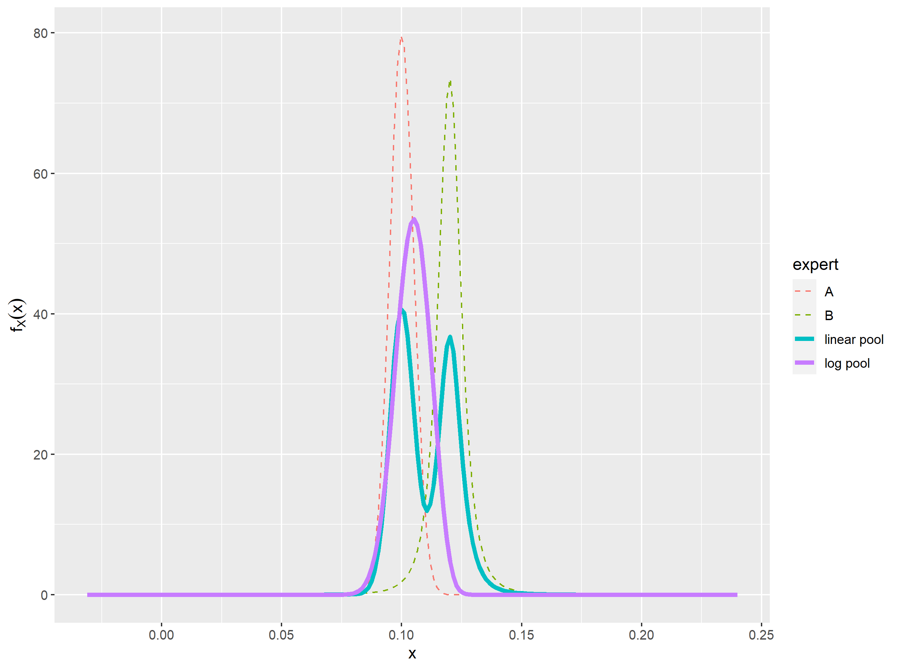
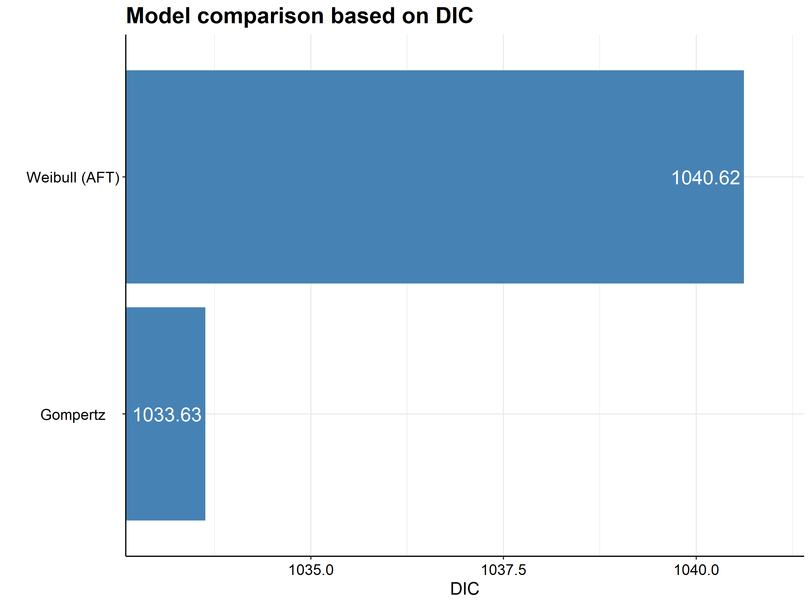
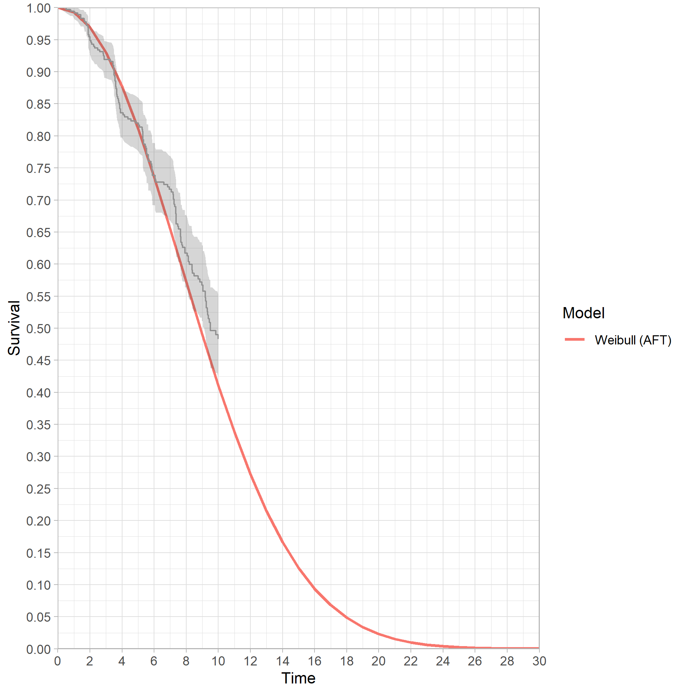
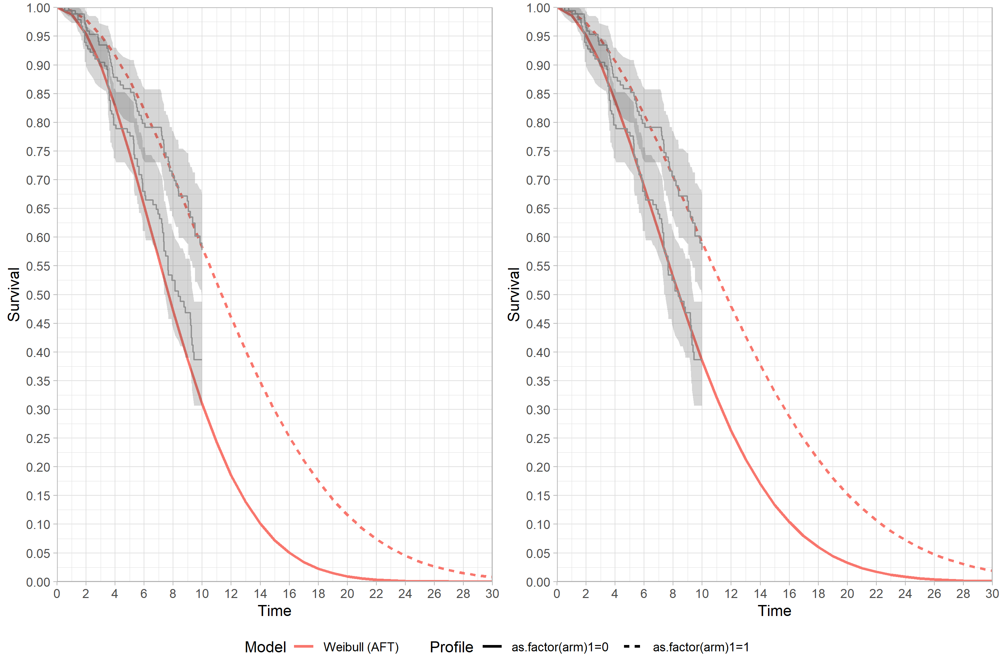

<!-- README.md is generated from README.Rmd. Please edit that file -->

```{r, include = FALSE}
knitr::opts_chunk$set(
  collapse = TRUE,
  comment = "#>"
)
```

# expert-surv

<!-- badges: start -->
<!-- badges: end -->

The goal of $\texttt{expertsurv}$ is to incorporate expert opinion into an analysis of time to event data. $\texttt{expertsurv}$ uses many of the core functions of the $\texttt{survHE}$ package [@Baio.2020]. Technical details of the implementation are detailed in [@Cooney.2021] and will not be repeated here. 


The key function is `fit.models.expert` and operates almost identically to the `fit.models` function of $\texttt{survHE}$.


## Installation

You can install the released version of expertsurv from [GitHub](https://github.com/Philip-Cooney/expertsurv) with:

``` r
devtools::install_github("Philip-Cooney/expertsurv")
```


## Expert Opinion on Survival at timepoints

If we have elicited expert opinion of the survival probability at certain timepoint(s) and assigned distributions to these beliefs, we encode that information as follows:

```{r}
#A param_expert object; which is a list of 
#length equal to the number of timepoints
param_expert_example1 <- list()

#If we have 1 timepoint and 2 experts
#dist is the names of the distributions
#wi is the weight assigned to each expert (usually 1)
#param1, param2, param3 are the parameters of the distribution
#e.g. for norm, param1 = mean, param2 = sd
#param3 is only used for the t-distribution and is the degress of freedom.
#We allow the following distributions:
#c("normal","t","gamma","lognormal","beta") 


param_expert_example1[[1]] <- data.frame(dist = c("norm","t"),
                                         wi = c(1,1),
                                         param1 = c(0.1,0.12),
                                         param2 = c(0.005,0.005),
                                         param3 = c(NA,3))
param_expert_example1

#Naturally we will specify the timepoint for which these probabilities where elicited

timepoint_expert <- 14


#In case we wanted a second timepoint -- Just for illustration

# param_expert_example1[[2]] <- data.frame(dist = c("norm","norm"),
#                                          wi = c(1,1),
#                                          param1 = c(0.05,0.045),
#                                          param2 = c(0.005,0.005),
#                                          param3 = c(NA,NA))
# 
# timepoint_expert <- c(timepoint_expert,18)

```

If we wanted opinions at multiple timepoints we just include append another list (i.e. param_expert_example1[[2]] with the relevant parameters) and specify timepoint_expert as a vector of length 2 with the second element being the second timepoint.  

For details on assigning distributions to elicited probabilities and quantiles see the $\texttt{SHELF}$ package [@SHELF.2021] and for an overview on methodological approaches to eliciting expert opinion see [@OHagan.2019]. We can see both the individual and pooled distributions using the following code (note that we could have used the output of the `fitdist` function from $\texttt{SHELF}$ if we actually elicited quantiles from an expert):

```
plot_opinion1<- plot_expert_opinion(param_expert_example1[[1]], 
                    weights = param_expert_example1[[1]]$wi)
ggsave("Vignette_Example 1 - Expert Opinion.png")

```

For the linear pool we have a bi-modal distribution which has a $95\%$ credible interval between $9.15 - 13.2\%$ calculated with the function below:  

```{r echo = FALSE, fig.cap = "Expert prior distributions"}

```

```
cred_int_val <- cred_int(plot_opinion1,val = "linear pool", interval = c(0.025, 0.975))
```

We load and fit the data as follows (in this example considering just the Weibull and Gompertz models), with  pool_type = "linear pool" specifying that we want to use the default linear pooling (rather than "log pool").

```

data2 <- survHE::data %>% rename(status = censored) %>% mutate(time2 = ifelse(time > 10, 10, time),
                                                              status2 = ifelse(time> 10, 0, status))

#Set the opinion type to "survival"

example1  <- expertsurv:::fit.models.expert(formula=Surv(time2,status2)~1,data=data2,
                                        distr=c("wei", "gomp"),
                                        method="hmc",
                                        iter = 5000,
                                        pool_type = "linear pool", 
                                        opinion_type = "survival",
                                        times_expert = timepoint_expert, 
                                        param_expert = param_expert_example1)

```
Both visual fit and model fit statistics highlight that the Weibull model is a poor fit to both the expert opinion and data. 

```
model.fit.plot(example1, type = "dic")

 plot(example1, add.km = T, t = 0:30)+
  theme_light()+
  scale_x_continuous(expand = c(0, 0), limits = c(0,NA), breaks=seq(0, 30, 2)) + 
  scale_y_continuous(expand = c(0, 0), limits = c(0, NA), breaks=seq(0, 1, 0.05))+
  geom_segment(aes(x = 14, y = cred_int_val[1], xend = 14, yend = cred_int_val[2]))

```
```{r echo = FALSE, fig.cap = "Model Comparison"}

```

```{r echo = FALSE, fig.cap = "Survival function with Expert prior"}

```


## Expert Opinion on Survival of a comparator arm


In this situation we place an opinion on the comparator arm. 

```
param_expert_example2[[1]] <- data.frame(dist = c("norm"),
                                         wi = c(1),
                                         param1 = c(0.1),
                                         param2 = c(0.005),
                                         param3 = c(NA))
```

```{r}
#Check the coding of the arm variable
#Comparator is 0, which is our id_St
unique(survHE::data$arm)

```

```
survHE.data.model  <- expertsurv:::fit.models.expert(formula=Surv(time2,status2)~as.factor(arm),data=data2,
                                        distr=c("wei"),
                                        method="hmc",
                                        iter = 5000,
                                        opinion_type = "survival",
                                        id_St = 0, 
                                        times_expert = timepoint_expert, 
                                        param_expert = param_expert_example2)
```

We can remove the impact of expert opinion by running the same model in the $\texttt{survHE}$ package. Alternatively we note that a $\mathcal{B}(1,1)$ distribution is uniform on the survival probability and does not change the likelihood. 

```
param_expert_vague <- list()
param_expert_vague[[1]] <- data.frame(dist = "beta", wi = 1, param1 = 1, param2 = 1, param2 = NA)

```

```{r echo = FALSE, fig.cap = "Survival function with Expert prior (left) and Vague prior (right)"}

```

The survival function for "arm 1" has been shifted downwards slightly, however the covariate for the accelerated time factor has markedly increased to counteract the lower survival probability for the reference (arm 0).

## Expert Opinion on Survival Difference

This example illustrates an opinion on the survival difference.
For illustration we use the Gompterz, noting that a negative shape parameter will lead to a proportion of subjects living forever.
Clearly the mean is not defined in these cases so the code automatically constrains the shape to be positive. 

```
param_expert3 <- list()

#Prior belief of 5 "months" difference in expected survival
param_expert3[[1]] <- data.frame(dist = "norm", wi = 1, param1 = 5, param2 = 0.2, param3 = NA)


survHE.data.model  <- expertsurv:::fit.models.expert(formula=Surv(time2,status2)~as.factor(arm),data=data2,
                                                     distr=c("gom"),
                                                     method="hmc",
                                                     iter = 5000,
                                                     opinion_type = "mean",
                                                     id_trt = 1, # Survival difference is Mean_surv[id_trt]- Mean_surv[id_comp] 
                                                     param_expert = param_expert3)

```

```{r echo = FALSE, fig.cap = "Survival difference"}
knitr::include_graphics("Vignette_Example 3.png")
```


## Compatability with survHE

As stated in the introduction this package relies on many  of the core functions of the $\texttt{survHE}$ package [@Baio.2020]. In theory a new version of $\texttt{survHE}$ could result in a lack of compatibility with this package, however, any required changes should be minor. Because the objective of this package was to fit the models with expert opinion, plot the survival curves and compare the goodness of fit, these capabilities (which have been presented in this README) have been tested for compatibility. Other functions should (in theory) be compatible, however, I have not tested these use cases. If you run in issues, bugs or just features which you feel would be useful, please let me know and I will investigate and update as required. 

Additionally I have made modifications to some of the $\texttt{survHE}$ functions to accommodate JAGS models (by changing the namespace of the $\texttt{survHE}$ environment). These should have no impact on the operation of $\texttt{survHE}$ and these changes are only invoked when $\texttt{expertsurv}$ is loaded. However, in the situation where you would like to revert to $\texttt{survHE}$ functions during the session, simply run the following:

```
unloadNamespace("survHE") #Unload survHE and associated name spaces
require("survHE") #reload survHE
```
One practical difference between the packages is the calculation of DIC (Deviance Information Criterion). In  $\texttt{survHE}$ the posterior median is used as the plug-in estimate for the log-likelihood, while we use the posterior mean as per the definition of DIC by [@Spiegelhalter.2003], noting that both estimates should be very similar. 

## References 
