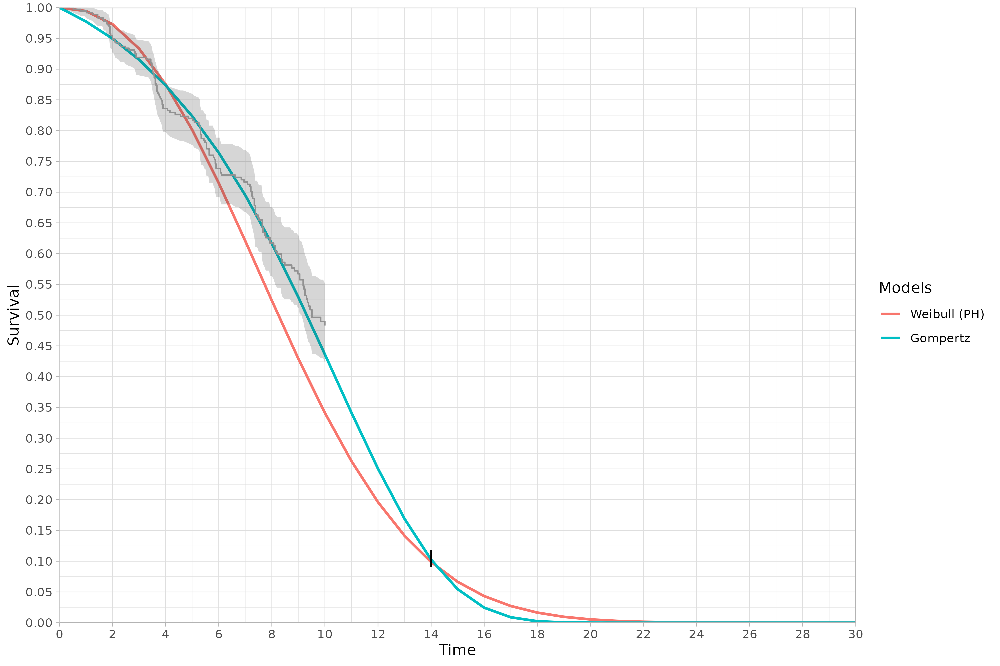
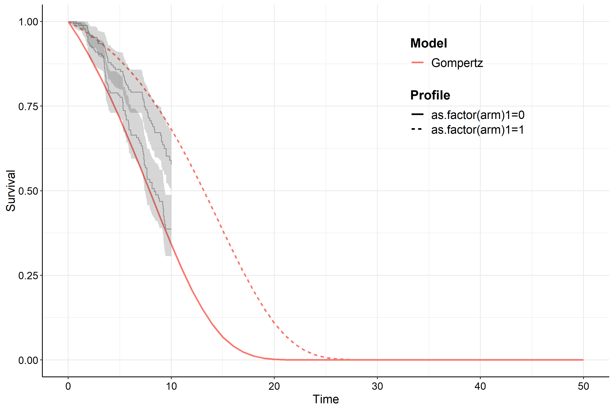

```{r, include = FALSE,echo = FALSE}
knitr::opts_chunk$set(
  collapse = TRUE,
  comment = "#>")
library("expertsurv")

options(rmarkdown.html_vignette.check_title = FALSE)


```


# expert-surv

<!-- badges: start -->
<!-- badges: end -->

The goal of $\texttt{expertsurv}$ is to incorporate expert opinion into an analysis of time to event data. $\texttt{expertsurv}$ uses many of the core functions of the $\texttt{survHE}$ package [@Baio.2020]. Technical details of the implementation are detailed in [@Cooney.2023] and will not be repeated here. 


The key function is `fit.models.expert` and operates almost identically to the `fit.models` function of $\texttt{survHE}$.


## Expert Opinion on Survival at timepoints

If we have elicited expert opinion of the survival probability at certain timepoint(s) and assigned distributions to these beliefs, we encode that information as follows:

```{r}
#A param_expert object; which is a list of 
#length equal to the number of timepoints
param_expert_example1 <- list()

#If we have 1 timepoint and 2 experts
#dist is the names of the distributions
#wi is the weight assigned to each expert (usually 1)
#param1, param2, param3 are the parameters of the distribution
#e.g. for norm, param1 = mean, param2 = sd
#param3 is only used for the t-distribution and is the degress of freedom.
#We allow the following distributions:
#c("normal","t","gamma","lognormal","beta") 


param_expert_example1[[1]] <- data.frame(dist = c("norm","t"),
                                         wi = c(0.5,0.5), # Ensure Weights sum to 1
                                         param1 = c(0.1,0.12),
                                         param2 = c(0.005,0.005),
                                         param3 = c(NA,3))
param_expert_example1

#Naturally we will specify the timepoint for which these probabilities where elicited

timepoint_expert <- 14


#In case we wanted a second timepoint -- Just for illustration

# param_expert_example1[[2]] <- data.frame(dist = c("norm","norm"),
#                                          wi = c(1,1),
#                                          param1 = c(0.05,0.045),
#                                          param2 = c(0.005,0.005),
#                                          param3 = c(NA,NA))
# 
# timepoint_expert <- c(timepoint_expert,18)

```

If we wanted opinions at multiple timepoints we just include append another list (i.e. param_expert_example1[[2]] with the relevant parameters) and specify timepoint_expert as a vector of length 2 with the second element being the second timepoint.  

For details on assigning distributions to elicited probabilities and quantiles see the $\texttt{SHELF}$ package [@SHELF.2021] and for an overview on methodological approaches to eliciting expert opinion see [@OHagan.2019]. We can see both the individual and pooled distributions using the following code (note that we could have used the output of the `fitdist` function from $\texttt{SHELF}$ if we actually elicited quantiles from an expert):

```
plot_opinion1<- plot_expert_opinion(param_expert_example1[[1]], 
                    weights = param_expert_example1[[1]]$wi)
ggsave("Vignette_Example 1 - Expert Opinion.png")

```

For the log pool we have a uni-modal distribution  (in contrast to the bi-modal linear pool) which has a $95\%$
credible interval between $9.0−11.9\%$ calculated with the function below:

```{r echo = FALSE, fig.cap = "Expert prior distributions", out.width="100%"}
knitr::include_graphics("plots/Vignette_Example_1_Expert_Opinion.png")

```

```
cred_int_val <- cred_int(plot_opinion1,val = "log pool", interval = c(0.025, 0.975))
```

We load and fit the data as follows (in this example considering just the Weibull and Gompertz models), with `pool_type = "log pool"` specifying that we want to use the  logarithmic pooling (rather than default "linear pool"). We do this as we wish to compare the results to the penalized maximum likelihood estimates in the next section.

```

data2 <- data %>% rename(status = censored) %>% mutate(time2 = ifelse(time > 10, 10, time),
                                                              status2 = ifelse(time> 10, 0, status))

#Set the opinion type to "survival"

example1  <- fit.models.expert(formula=Surv(time2,status2)~1,data=data2,
                                        distr=c("wph", "gomp"),
                                        method="hmc",
                                        iter = 5000,
                                        pool_type = "log pool", 
                                        opinion_type = "survival",
                                        times_expert = timepoint_expert, 
                                        param_expert = param_expert_example1)

```
Both visual fit and model fit statistics highlight that the Weibull model is a poor fit to both the expert opinion and data (black line referring to the $95\%$ confidence region for the experts prior belief). 

```
model.fit.plot(example1, type = "dic")

#N.B. plot.expertsurv (ported directly from survHE) plots the survival function at the posterior mean parameter values
#     while it is more robust to use the entire posterior sample (make.surv), however, in this case both results are similar. 

 plot(example1, add.km = T, t = 0:30)+
  theme_light()+
  scale_x_continuous(expand = c(0, 0), limits = c(0,NA), breaks=seq(0, 30, 2)) + 
  scale_y_continuous(expand = c(0, 0), limits = c(0, NA), breaks=seq(0, 1, 0.05))+
  geom_segment(aes(x = 14, y = cred_int_val[1], xend = 14, yend = cred_int_val[2]))

```
```{r echo = FALSE, fig.cap = "Model Comparison", out.width="100%"}
knitr::include_graphics("plots/Vignette_Example_1_DIC.png")
```

```{r echo = FALSE, fig.cap = "Survival function with Expert prior", out.width="100%"}

```


## Expert Opinion using Penalized Maximum Likelihood

We can also fit the model by Penalized Maximum Likelihood approaches through the $\texttt{flexsurv}$ package [@flexsurv]. All that is required that the `method="hmc"` is changed to `method="mle"` with the `iter` argument now redundant. One argument that maybe of interest is the `method_mle` which is the optimization procedure that $\texttt{flexsurv}$ uses. In case the optimization fails, we can sometimes obtain convergence with the "Nelder-Mead" algorithm. If the procedure is still failing, it may relate to the expert opinion being too informative. 

It should be noted that the results will be similar to the Bayesian approach when the expert opinion is unimodal (as maximum liklelihood produces a point estimate) and relatively more informative, therefore we use the logarithmic pool which is unimodal. 

We find that the AIC values also favour the Gompertz model by a large factor (not shown) and are very similar to the DIC presented for the Bayesian model.


<!-- ```{r echo = FALSE, fig.cap = "Survival function with Expert Information-Penalized Maximum Likelihood"} -->
<!-- knitr::include_graphics("inst/image/MLE-Weibull-Gomp.png") -->
<!-- ``` -->

$\texttt{expertsurv}$ modifies some of the $\texttt{flexsurv}$ functions, so if you wish to use revert to the original $\texttt{flexsurv}$ functions within the same session you should run the following commands:

```
    unloadNamespace("flexsurv") #Unload flexsurv and associated name spaces
    require("flexsurv") #reload flexsurv
```


## Expert Opinion on Survival of a comparator arm


In this situation we place an opinion on the comparator arm. 

```
param_expert_example2[[1]] <- data.frame(dist = c("norm"),
                                         wi = c(1),
                                         param1 = c(0.1),
                                         param2 = c(0.005),
                                         param3 = c(NA))
```

```{r}
#Check the coding of the arm variable
#Comparator is 0, which is our id_St
unique(data$arm)

```

```
survHE.data.model  <- fit.models.expert(formula=Surv(time2,status2)~as.factor(arm),data=data2,
                                        distr=c("wei"),
                                        method="hmc",
                                        iter = 5000,
                                        opinion_type = "survival",
                                        id_St = 0, 
                                        times_expert = timepoint_expert, 
                                        param_expert = param_expert_example2)
```

We can remove the impact of expert opinion by running the same model in the $\texttt{survHE}$ package. Alternatively we note that a $\mathcal{Beta}(1,1)$ distribution is uniform on the survival probability and does not change the likelihood. 

```
param_expert_vague <- list()
param_expert_vague[[1]] <- data.frame(dist = "beta", wi = 1, param1 = 1, param2 = 1, param2 = NA)

```

```{r echo = FALSE, fig.cap = "Survival function with Expert prior (left) and Vague prior (right)", out.width="100%"}
knitr::include_graphics("plots/Vignette_Example_2.png")
```

The survival function for "arm 1" has been shifted downwards slightly, however the covariate for the accelerated time factor has markedly increased to counteract the lower survival probability for the reference (arm 0).

## Expert Opinion on Survival Difference

This example illustrates an opinion on the survival difference.
For illustration we use the Gompertz, noting that a negative shape parameter will lead to a proportion of subjects living forever.
Clearly the mean is not defined in these cases so the code automatically constrains the shape to be positive. 

```
param_expert3 <- list()

#Prior belief of 5 "months" difference in expected survival
param_expert3[[1]] <- data.frame(dist = "norm", wi = 1, param1 = 5, param2 = 0.2, param3 = NA)


survHE.data.model  <- fit.models.expert(formula=Surv(time2,status2)~as.factor(arm),data=data2,
                                                     distr=c("gom"),
                                                     method="hmc",
                                                     iter = 5000,
                                                     opinion_type = "mean",
                                                     id_trt = 1, # Survival difference is Mean_surv[id_trt]- Mean_surv[id_comp] 
                                                     param_expert = param_expert3)

```

```{r echo = FALSE, fig.cap = "Survival difference", out.width="100%"}

```


## Compatability with underlying packages survHE and flexsurv

As stated in the introduction this package relies on many  of the core functions of the $\texttt{survHE}$ package [@Baio.2020]. Because we do not not implement expert opinion with INLA and because future versions of $\texttt{survHE}$ may introduce conflicts with the current implementation, we have directly ported the key functions from $\texttt{survHE}$ into the package so that $\texttt{expertsurv}$ no longer imports $\texttt{survHE}$ (of course all credit for those functions goes to [@Baio.2020] and co-authors).


In theory the same concern could apply to $\texttt{flexsurv}$ package [@flexsurv], however, this package has been released for some years and it is unlikely that the code architecture would change sufficiently to cause issues (however, for reference $\texttt{expertsurv}$ was built  with  $\texttt{flexsurv}=\text{v}2.0$).

If you run in issues, bugs or just features which you feel would be useful, please let me know (phcooney@tcd.ie) and I will investigate and update as required. 

As mentioned, I have made modifications to some of the $\texttt{flexsurv}$ functions to accommodate exper opinion (by changing the functions within the namespace of the $\texttt{flexsurv}$ environment). These should have no impact on the operation of $\texttt{flexsurv}$ and these changes are only invoked when $\texttt{flexsurv}$ is loaded. However, in the situation where you would like to revert to orginal $\texttt{flexsurv}$ functions during the session, simply run the following:

```

unloadNamespace("flexsurv") #Unload flexsurv and associated name spaces
require("flexsurv") #reload flexsurv


```
Care should be taken, however to ensure the packages were successfully unloaded as other packages which require  $\texttt{flexsurv}$ can block the unloading to that package (which will cause an error).


<!-- One practical difference between the packages is the calculation of DIC (Deviance Information Criterion). In  $\texttt{survHE}$ the posterior median is used as the plug-in estimate for the log-likelihood, while we use the posterior mean as per the definition of DIC by [@Spiegelhalter.2003], noting that both estimates should be very similar.  -->


<!-- ## Survival curves implied by Expert Opinion alone -->

<!-- In some situations it may be of interest to see the range of predicted survival functions given the expert opinion. The easiest solution is to simulate two or more observations. In order to remove the effect of these data points we supply the following argument to the `fit.models.expert` function which essentially sets the likelihood contribution to zero for these points: -->

<!-- ``` -->
<!-- a0 = rep(0.001,nrow(df1)) -->
<!-- ``` -->
<!-- Using Stan and JAGS to simulate these "posteriors" is inefficient and because of lack of identifiability (due to having no data), Markov Chain Monte Carlo diagnostics will suggest there is a problem. A more efficient approach for the Weibull distribution is sketched out below and (similar to [@Ouwens.2018]) would be to: -->

<!--  - Simulate times from the Survival distribution  -->
<!--  - Simulate values of the shape from a vague distribution -->
<!--  - Reexpress the scale in terms of the shape  -->

<!--  As we can see the 90% credible intervals are very wide, narrowing only at the timepoint at which there is expert opinion. -->

<!-- ``` -->

<!-- nsims <- 10000 -->
<!-- Surv_samp <- rbeta(nsims, 10, 100) -->
<!-- ancs <- runif(nsims, 0, 10) #shape -->
<!-- time_expert <- 14 -->
<!-- loc <- exp((ancs*log(time_expert)-log(-log(Surv_samp)))/ancs) -->

<!-- time <- c(0:20) -->
<!-- res <- cbind(ancs,loc) -->

<!-- St <- apply(res, 1, function(x){pweibull(time,x[1],x[2], lower.tail = F )}) -->
<!-- St_sum <- apply(St, 1, quantile, probs = c(0.1, 0.9), na.rm = T) -->

<!-- plot(y = St_sum[1,], x = time, type= "l", xlab = "Time", ylab = "St", -->
<!-- main = "90% interval for survival with St from Beta(10,100)") -->
<!-- lines(y = St_sum[2,], x = time ) -->

<!-- ``` -->

<!-- ```{r echo = FALSE, fig.cap = "Predicted survival without data"} -->
<!-- knitr::include_graphics("Survival without Data.png") -->
<!-- ``` -->

## Model Diagnostics

As this is a Bayesian analysis convergence diagnostics should be performed. Poor convergence can be observed for many reasons, however, because of our use of expert opinion it may be a symptom of conflict between the observed data and the expert's opinion. 

Default priors should work in most situations, but still need to be considered. At a minimum the Bayesian results without expert opinion should be compared against the maximum likelihood estimates. If considerable differences are present the prior distributions should be investigated.  

Because the analysis is done in JAGS and Stan we can leverage the `ggmcmc` package:

```
#For Stan Models # Log-Normal, RP, Exponential, Weibull
ggmcmc(ggs(as.mcmc(example1$models$`Gen. Gamma`)), file = "Gengamma.pdf")

#For JAGS Models # Gamma, Gompertz, Generalized Gamma
ggmcmc(ggs(as.mcmc(example1$models$`Gamma`)), file = "Gamma.pdf")

```


## References 
